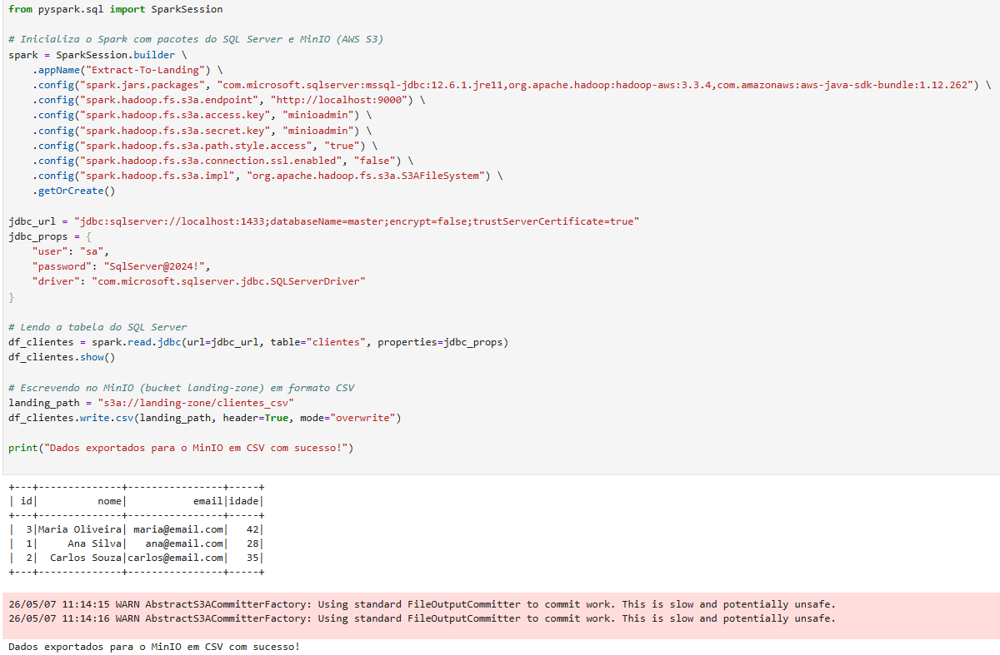
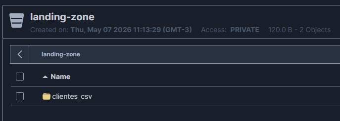

# Requisito 1: Extração do Banco de Dados para a Landing Zone

## O que foi solicitado
> "O trabalho 2 é um complemento do trabalho 1, onde vocês deverão implementar a extração dos dados de todas as tabelas de um banco de dados (relacional ou não relacional - livre escolha) e gravar em um bucket no MinIO chamado 'landing-zone' no formato CSV."

## Nossa Implementação

Para atender a este requisito, escolhemos a abordagem **Relacional**, utilizando o **SQL Server** como nosso banco de dados de origem.

O fluxo desenvolvido realiza os seguintes passos:
1. Conecta-se ao SQL Server (rodando isoladamente em um container Docker) via PySpark utilizando o driver JDBC oficial da Microsoft.
2. Realiza a leitura integral das tabelas.
3. Escreve os dados de forma bruta (raw data) no bucket `landing-zone`, criado no **MinIO**, utilizando rigorosamente o formato `CSV` conforme requisitado.

---

## Evidências de Execução (Prints)

Para comprovar o atendimento perfeito deste requisito, abaixo estão os registros visuais da nossa execução:

### Execução da Extração via Código

### Persistência no MinIO (Bucket Landing Zone)

