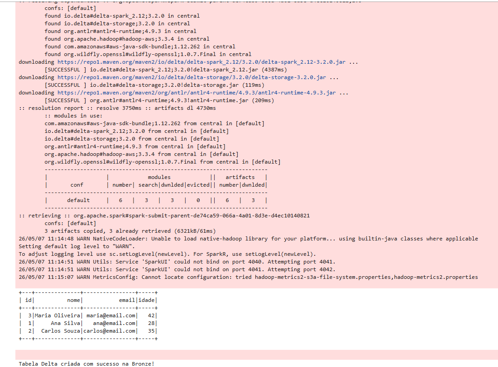
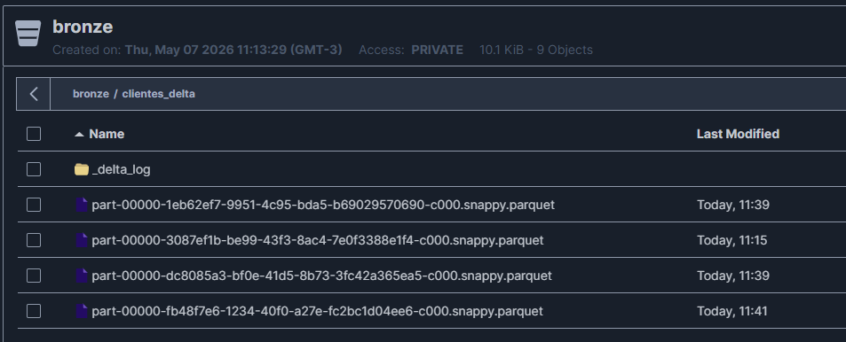

# Requisito 2: Conversão de CSV para Delta Lake (Camada Bronze)

## O que foi solicitado
> "Após a extração, vocês deverão ler os arquivos CSV ou JSON do bucket 'landing-zone' e gravar no formato DELTA LAKE em um novo bucket chamado 'bronze’."

## Nossa Implementação

A segunda etapa do pipeline atua no processamento e estruturação dos dados que foram previamente ingeridos de forma crua. Para isso, nosso script PySpark atua como ponte de ETL realizando as seguintes ações:

1. **Leitura da Origem:** Recupera o arquivo `CSV` gerado na etapa anterior que está hospedado dentro do bucket `landing-zone` do MinIO.
2. **Setup do Delta:** Inicializa as extensões analíticas do Spark configurando o suporte total ao **Delta Lake**, responsável por gerenciar logs transacionais no Object Storage.
3. **Escrita na Camada Seguinte:** Grava esse mesmo *DataFrame* em um novo bucket chamado `bronze`, alterando explicitamente o formato de saída para Delta (Parquet + _delta_log).

---

## Evidências de Execução (Prints)

Para comprovar a transformação do dado e o isolamento das camadas no MinIO, confira os registros abaixo:

### Código de Conversão Rodando com Sucesso

### Persistência no MinIO (Bucket Bronze) em Formato Delta

