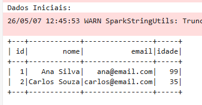
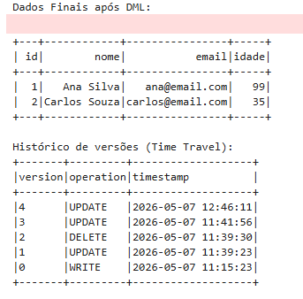

# Requisito 3: Operações DML no Delta Lake

## O que foi solicitado
> "Após a conversão para DELTA LAKE, reproduza as 3 operações de DML (insert, update e delete) feitas no trabalho anterior para as tabelas DELTA LAKE do bucket 'bronze' (não precisa usar todas as tabelas)."

## Nossa Implementação

O principal diferencial arquitetural de salvar arquivos no formato Delta Lake (e não Parquet tradicional) é justamente obter suporte nativo às operações DML (Data Manipulation Language) regidas por garantias transacionais ACID, mesmo lidando com um Object Storage descentralizado como o MinIO.

Para comprovar esse comportamento, criamos e executamos o caderno `03_dml_delta.ipynb`, aplicando as três operações fundamentais sobre a nossa tabela Delta na camada Bronze:

---

## Evidências de Execução (Prints das Operações DML)

Abaixo, comprovamos graficamente a execução do Spark modificando a tabela Delta.

### 1. Inserção de Dados (Insert / Append)
Adicionamos com sucesso um novo registro à tabela (ex: um novo cliente) provando a habilidade de expansão da base Delta.

### 2. Atualização de Dados (Update)
Modificamos o valor de um registro pré-existente (ex: corrigindo um nome ou uma idade) aplicando uma cláusula de condição `UPDATE WHERE` do Spark.

### 3. Exclusão de Dados (Delete)
Removemos um registro específico da nossa tabela Delta passando um identificador (ID) como condição para o comando `DELETE`. O Delta cuidou de invalidar atomicamente os arquivos Parquet antigos.

### Extra: Histórico de Alterações (Time Travel)
Além das 3 operações exigidas, a simples execução do comando `.history()` na nossa tabela Delta no final do caderno prova o versionamento ativado de forma imutável pelo ecossistema Lakehouse.

